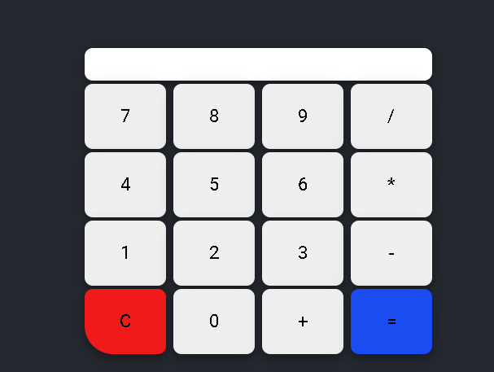

## :bookmark_tabs: Calc

Project inspired by youtube channel [Joaby Oliveira](https://www.youtube.com/watch?v=Jbv9AQDdVZ4&t=150s5)

# Algorithm

- HTML,
  - Caixa de texto para o visor;
  - Botões do números e operações aritméticas;
  - Import Javascript page and Css page

* Javascript
  - Coletar dados do HTML(valor e resultado);
  - Adicionar função aos números;
  - Adicionar função para calcular,
  - Adicionar função para resetar a calculadora,

# Elements used

## HTML

- input type="text",
- input type="button",
- form

## Javascript

- Variable,
- eval,
- .value,

## CSS

- Margin,
- border,
- padding,
- background-image,
- background-repeat,
- font-family
- color,
- widht,
- display,
- justify-content
- flex-direction
- cursos
- :hover
- outline
- font-size
- align-items
- height
- box-shadow
- filter: brightness
- transform:scale

### HTML

(index.html)
| Elemento | Função | Conteudo
| ------ | ------ | ------|
| Meta charset | Definir conjunto de caracteres| UTF-8
| Title | Titulo da pagina | Calc
| Form | Definir cabeçalhos HTML |To do List
| Id / Class| Especificar algum elemento | app / background
| Input type="text"| Caixa de texto | Visor da calculadora
| input type="button" | Cria um botão clicável | Adiciona um numero na calculadora
[Fonte](https://www.tutorialrepublic.com/html-reference)

### JavaScript

(todos.js)
| Variavel/Função | Função | Comando
| ------ | ------ | ------|
| var valor | Armazenar valor do visor | var valor ;
| var resultado | Armazenar valor do resultado | var resultado;
| function botao | adicionar funcionilidade aos botões| valor = document.calc.visor.value += num;
| function reseta | Reseta o visor | document.calc.visor.value = '';
| function calcula | Adicionar a função do calculo |resultado = eval(valor); document.calc.visor.value = resultado.toLocaleString('pt-BR');

### CSS

(styles.html)
| PROPRIEDADE | Função
| ------ | ------ |
| margin | Regular espaço ao redor dos elementos|
| border | Regular espaço ao redor dos elementos |
| padding | Regular espaço ao redor dos elementos |
| background-image| Definir plano de fundo como imagem(linear-gradient:Criar uma gradiente linear)| | background-color | Definir cor de plano de fundo |
| background-repeat| Regular a repitação do plano de fundo |
| font-family | Fonte utilizada |
| color | Cor da fonte |
| width | Regular a altura do elemento |
| display | especifica o comportamento de exibição |
| justify-content | propriedade alinha os itens |
| flex-direction | Propriedade especifica a direção dos itens flexíveis. |
| cursor| Definir cursor ápos o usario passar o mouse pelo elemnto |
| :hover | Ação ápos o usario passar o mouse pelo elemento |
[Fonte w3schools](https://www.w3schools.com/cssref/)
