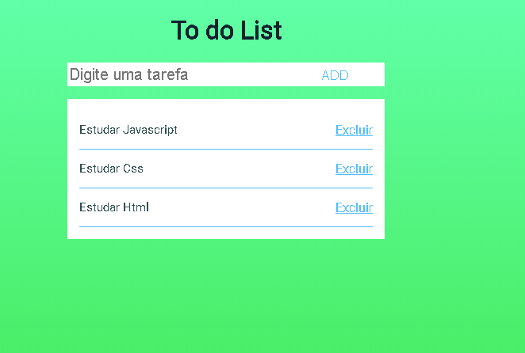

## :bookmark_tabs: To do list
Project inspired by Rockseat's javascript starter class and Carlos da Costa's designer [Carlos da Costa](https://blog.usejournal.com/develop-a-to-do-list-app-in-vanilla-javascript-95377ec370c5)

# Algorithm

- HTML,
  - Caixa de texto para escrever a tarefa;
  - Botão para adicionar uma tarefa;
  - Elemento para lista,

- Javascript
  - Coletar dados do HTML(query.Selector);
  - Renderizar lista no html;
  - Adicionar lista no html,
  - Remover lista no html,
  - Salvar lista no html,

# Elements used
## HTML
  - Input type,
  - Button,
  - Import Javascript page and Css page
## Javascript
- Variable,
- QuerySelector,
- JSON,
- createElement,
- innerHTML,
- For(of)
- indexOf
- setAttribute
- appendChild
- input.value,
- push
- savetoStorage
- onclick 
- splice
- localStorage.setItem 
- JSON.stringify

## CSS
- Margin,
- border,
- padding,
- background-image,
- background-repeat,
- font-family
- color,
- widht,
- display,
- justify-content
- flex-direction
- cursos
- :hover

### HTML
(index.html)
| Elemento | Função | Conteudo
| ------ | ------ | ------|
| Meta charset  | Definir conjunto de caracteres| UTF-8
| Title | Titulo da pagina | To do List
| h1 | Definir cabeçalhos HTML |To do List
| Id / Class| Especificar algum elemento | app / background
| Input type="text"| Caixa de texto | 
| Placeholder | Uma dica ao usuário  | Digite uma tarefa
| Button | Cria um botão clicável  | ADD
| ul | lista não ordenada de itens  | Tarefas
| script | Usada para incorporar um script  | "todos.js"
[Fonte](https://www.tutorialrepublic.com/html-reference)

### JavaScript
(todos.js)
| Variavel/Função | Função | Comando
| ------ | ------ | ------|
| var listElement  | Procurar no html o elemento ul| document.querySelector('#app ul');
| var inputElement | Procurar no html o elemento input | document.querySelector('#app input');
| var buttonElement | Procurar no html o elemento botão |document.querySelector('#app button')
| var todos| Transformar os dados salvos em Json para uma array/Busca a array em Json salvos   | JSON.parse(localStorage.getItem('list_todos')) ou []
| Input type="text"| Caixa de texto | 
| function renderTodos | Rendezirar as tarefas  | function renderTodos
| listElement.innerHTML| Remover todo conteudo do listElement para não repitir as tarefas | listElement.innerHTML ='';
|  for (todo of todos) | loops ou repitição sobre objetos iteráveis, como arrays, strings, etc |  for (todo of todos)
|  var todoElement | Cria o elemento li  | document.createElement('li')
| var todoText | Cria elemento de texto  | document.createTextNode(todo);
| var linkElement | Cria elemento a  | document.createElement('a');
| linkElement.setAttribute | Adicionando elemento href(link)  | linkElement.setAttribute('href','#');
| var linkText | Cria elemento de texto  | document.createTextNode('Excluir');
| var pos | Procurar a posição de cada item no array | todos.indexOf(todo);
| linkElement.setAttribute | Adiciona atributo(no clique) mais uma função + concatenar strings | ('onclick','deleteTodo('+ pos +')')
|  linkElement.appendChild(linkText) | adiciona o novo elemento no final de um elemento |  linkElement.appendChild(linkText)
| todoElement.appendChild(todoText); | adiciona o novo elemento no final de um elemento | todoElement.appendChild(todoText);
|  todoElement.appendChild(linkElement); | adiciona o novo elemento no final de um elemento |  todoElement.appendChild(linkElement);
|  listElement.appendChild(todoElement); | adiciona o novo elemento no final de um elemento |  listElement.appendChild(todoElement);
|  function addTodo | Adicionar uma tarefa  | function addTodo(){}
|  var todoText | Adicionar um valor em uma variavel  | inputElement.value
|  todos.push(todoText) | Adiciona um final de um array  | todos.push(todoText)
|  savetoStorage | Armazena os dados na memoria local  | savetoStorage
|  buttonElement.onclick | Adiciona uma função no elemento botão  | buttonElement.onclick = addTodo;
|  function deleteTodo(pos){} | Função delete tarefa  | document.createElement('li')
|  todos.splice | Recebe a posição no valor e remove um valor na proxima posição   | todos.splice(pos,1);
|  function savetoStorage(){}| Armazenamento local   | function savetoStorage(){}
|   localStorage.setItem('list_todos', JSON.stringify(todos))| Armazenar elementos no formato json   |  localStorage.setItem('list_todos', JSON.stringify(todos))
[Fonte curso starter Rockseat](https://rocketseat.com.br/)

### CSS
(styles.html)
| PROPRIEDADE | Função 
| ------ | ------ |
| margin |  Regular espaço ao redor dos elementos| 
| border | Regular espaço ao redor dos elementos | 
| padding | Regular espaço ao redor dos elementos |
| background-image| Definir plano de fundo como imagem(linear-gradient:Criar uma gradiente linear)| | background-color | Definir cor de plano de fundo  |
| background-repeat| Regular a repitação do plano de fundo | 
| font-family | Fonte utilizada  |
| color | Cor da fonte  | 
| width | Regular a altura do elemento  | 
| display | especifica o comportamento de exibição  | 
| justify-content | propriedade alinha os itens   | 
| flex-direction | Propriedade especifica a direção dos itens flexíveis.  | 
| cursor| Definir cursor ápos o usario passar o mouse pelo elemnto  | 
| :hover | Ação ápos o usario passar o mouse pelo elemento   | 
[Fonte w3schools](https://www.w3schools.com/cssref/)
